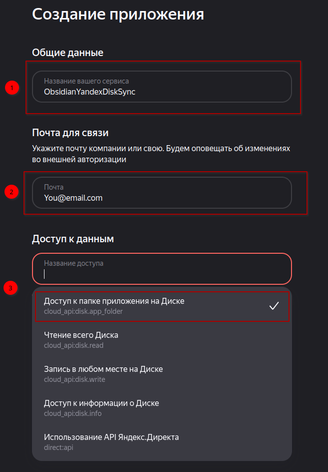
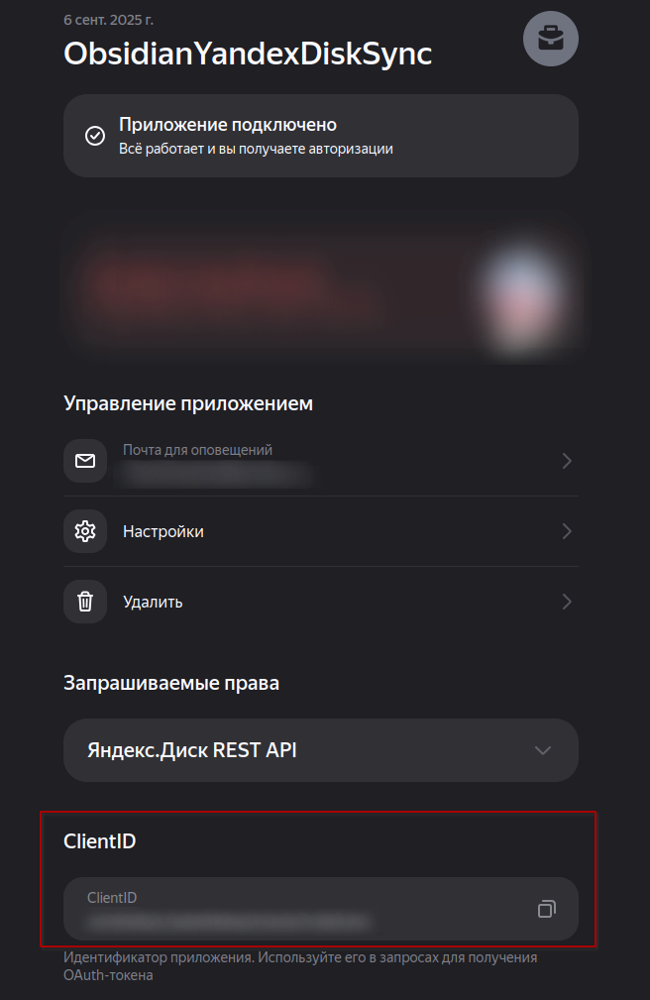

Yandex Disk Sync (плагин Obsidian)

[Russian](Documentation/README_ru.md) | [English](./README.md)

Обзор
- Синхронизация заметок и вложений между Obsidian и Яндекс.Диском (REST + OAuth).
- Работает на Desktop и Mobile (используется `requestUrl`).

Возможности
- OAuth (вставка токена), выбор регионального портала (oauth.yandex.ru/.com).
- Работа в «папке приложения»: по умолчанию используется `app:/` (доп. права не нужны).
- Подпапка для каждого вольта: «Vault folder name» (по умолчанию — имя вольта).
- Режимы two‑way / upload / download, настраиваемая политика удалений.
- Конфликты: newest‑wins (с допуском по времени) или duplicate‑both.
- Игнор‑шаблоны, локальная область, максимальный размер, параллелизм загрузок/выгрузок.
- Индикатор в статус‑баре + окно Progress (счётчики в реальном времени, Cancel/Copy/Sync/Dry‑run).
- Diagnostics (масштабируемое окно, копирование, новые логи сверху, число строк задаётся).
- Автосинхронизация по интервалу + синхронизация при старте (с задержкой).
- Пояснения к полям локализованы (RU/EN). Названия полей — на английском.

Установка
1) Скопируйте папку плагина в `<vault>/.obsidian/plugins/yandex-disk-sync/>`.
2) В Obsidian включите плагин в Settings → Community plugins.

Регистрация OAuth‑приложения (Client ID)
1) Откройте https://oauth.yandex.ru (или https://oauth.yandex.com).
2) Создайте приложение с доступом к «Yandex.Disk REST API». Для большинства сценариев — «доступ к папке приложения».

3) При создании укажите

- Название приложения например, ObsidianYandexDiskSync
- Ваш email
- Укажите тип доступа к данным, рекомендуется "Доступ к папке приложения на Диск", таким образом папка синхронизации будет "disk/Приложения/ObsidianYandexDiskSync"

4) Скопируйте Client ID.

Первичная настройка (Settings → Yandex Disk Sync)
- Client ID: вставьте Client ID.
- OAuth base URL: oauth.yandex.ru или oauth.yandex.com, в зависимости от аккаунта.
- OAuth scopes (optional): оставьте пустым — использовать права из настроек приложения (для «папки приложения» обязательно; иначе будет `invalid_scope`).
- Access Token: нажмите «Connect», дайте доступ, скопируйте `access_token` со страницы и вставьте в модальное окно; либо вставьте уже полученный токен.
- Remote base folder: корень в облаке (рекомендуется `app:/`).
- Vault folder name: подпапка внутри Remote base (по умолчанию — имя вашего вольта). Итоговый корень в облаке: `<Remote base>/<Vault folder name>`.
- Local scope: подпапка в вольте для синхронизации (пусто = весь вольт).
- Ignore patterns: шаблоны через запятую, напр. `.obsidian/**, **/.trash/**, **/*.tmp`.
- Sync mode: two‑way | upload | download.
- Delete policy: mirror (отражать удаления по индексу последней синхронизации) | skip (никогда не удалять).
- Conflict handling Strategy: newest‑wins (по времени; в пределах допуска — локальная) | duplicate‑both (сохранить обе версии).
- Time skew tolerance (sec): допуск времени для newest‑wins (типично 120–300).
- Max file size (MB): пропускать локальные файлы больше этого порога при выгрузке (по умолчанию 200).
- Concurrency (upload/download): параллельные потоки (рекомендация 1–3 / 1–4).
- Auto‑sync interval (minutes): 0 — выкл.; работает только пока открыт Obsidian.
- Sync on startup: запускать синхронизацию при старте; при необходимости укажите Startup delay (sec).
- Language: язык пояснений (Auto/English/Русский).

Использование
- Кнопка на боковой панели (Ribbon): запускает «Sync» (если уже идёт — не запускает второй раз).
- Статус‑бар: показывает состояние и счётчики; клик — открывает окно Progress.
- Окно Progress: фаза, счётчики, последние операции; кнопки Sync, Dry‑run, Copy All, Cancel.
- Команды: «Sync now», «Dry‑run (plan only)», «Diagnostics».

Как работает синхронизация (кратко)
- Сканирует локальные файлы (с учётом Local scope, Ignore patterns, Max size) и облако под `<Remote base>/<Vault folder name>`.
- Строит план операций: upload/download, remote‑delete/local‑delete, конфликты.
- Выполняет с ограничением по параллелизму; при 429 делает бэкофф; создаёт родительские папки при необходимости.
- После завершения обновляет индекс (времена/ревизии).

Режимы и удаления
- two‑way: синхронизация в обе стороны; с `mirror` удаления разносятся при условии, что другая сторона не менялась с последней синхронизации.
- upload: только локальные изменения → облако; из облака не подтягивает.
- download: только облако → локально; локальные изменения не отправляет.
- `skip`: никогда не удалять автоматически.

Конфликты
- newest‑wins: сравнивает метки времени, выбирает более свежую сторону; в пределах допуска — локальную.
- duplicate‑both: создаёт две локальные копии: «(conflict … local)» и «(conflict … remote)».

Diagnostics
- Показывает окружение (пути, режимы, стратегию), результат последней проверки API, последний HTTP‑код и последние строки журнала (новые сверху). Текст можно копировать. Число строк регулируется в настройках.

Безопасность
- Client ID может быть публичным. Никогда не публикуйте Client Secret и токены.
- Токены хранятся в данных плагина текущего вольта.

Частые проблемы
- `invalid_scope` при Connect: очистите «OAuth scopes» (оставьте пустым) для приложений «папка приложения».
- 403: у токена нет прав к пути — используйте `app:/` или токен с полным доступом для `disk:/`.
- 409: параллельные/дублирующиеся операции или ещё не создан родительский каталог — плагин повторит/создаст; снизьте параллелизм, если повторяется.
- «File name cannot contain \\ / :»: плагин избегает алиасов в локальных путях; если видите — проверьте целевой локальный путь в Diagnostics.

Документация Yandex Disk REST: https://yandex.com/dev/disk/rest/

